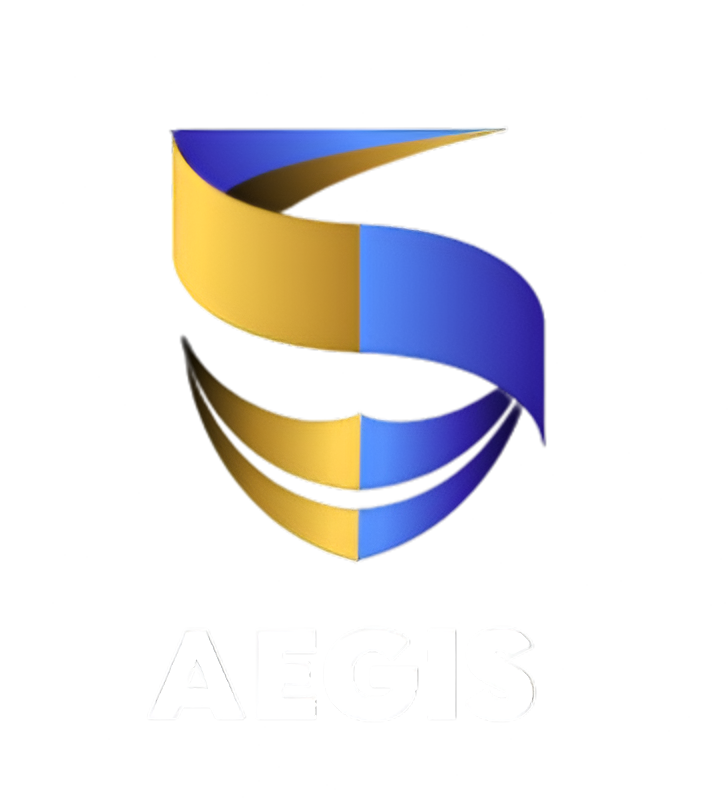

<div align="center">



# Aegis Protocol

**Advanced Image Security, Traceability, & Sanitization Suite**

[](https://tauri.app/)
[](https://reactjs.org/)
[](https://www.rust-lang.org/)
[](https://www.python.org/)
[](https://supabase.com/)

*Built meticulously for Desktop environments, fusing Web Technologies with native Rust performance.*

</div>

<br>

Aegis Protocol is a self-contained, high-security desktop application engineered to protect, verify, and sanitize highly sensitive visual information. Built on the modern **Tauri framework**, it bridges a hardware-accelerated **React interface** with three independent **Python Machine Learning engines** running locally on the user's host machine.

---

## ⚡ Core Engines

The suite utilizes three distinct Python-based subsystems orchestrated directly by the Rust native layer. 

### 1. Aegis Protect (Steganography Layer)
Powered by an implementation of **StegaStamp**, this engine embeds deep neural-network-based watermarks directly into image residuals. 
- **Resilience**: Watermarks mathematically survive downscaling, lossy compression, and even physical screen-capturing.
- **Traceability**: Allows administrators to silently inject provenance signatures (e.g., clearance codes) into sensitive documents prior to distribution.

### 2. Aegis Verify (Visual Cryptography)
Implements a strict `(2,2)` Visual Cryptography mesh to protect top-secret blueprints and node schematics.
- **Data Fragmentation**: Slices a single source image into pseudo-random noise fragments.
- **Decentralization**: The original media cannot be mathematically reconstructed without possessing all distributed fragments, allowing for Zero-Trust network storage.

### 3. Aegis Redact (NLP & AI-Vision Parsing)
Utilizing ultra-fast **MediaPipe** face extraction, **spaCy** NLP recognition, and **YOLO** object-detection, RedactionPro actively scrubs images.
- **Military Grade Filtering**: Instantly locates and masks human faces, vehicle plates, localized addresses, IP structures, and passwords in milliseconds.
- **Secure Handling**: Operates entirely offline—no data leaves the local vault for inference.

---

## 🏗️ Architecture Design

Aegis Protocol leverages **Tauri** as its engine orchestrator. Instead of forcing users to manually launch background Python fastAPIs, the Rust binary (`src-tauri/src/lib.rs`) automatically parses the environment, calculates python interpreters, and dynamically spawns all three ML engines in the background, terminating them gracefully when the UI is closed.

```text
aegis-protocol/
├── src/                  # React / TypeScript / CSS Frontend
│   ├── assets/           # Branding & Vectors
│   ├── lib/              # Zustand State, API polling, Supabase bindings
│   └── pages/            # 3-Column Obsidian Vault interface views
├── src-tauri/            # Rust Native Desktop Container
│   └── src/lib.rs        # Python Instance Life-Cycle Manager
└── backend/              # Local Compute Engines
    ├── stega/            # FastAPI Pipeline (Port 8000)
    ├── crypto/           # Flask Fragmenting (Port 5000)
    └── redaction/        # FastAPI Scrubbing (Port 8001)
```

---

## 🎨 The Obsidian Design System

Aegis Protocol uses a completely bespoke CSS architecture built natively—rejecting heavy utility frameworks in favor of clean, performant standard CSS mappings.

- **Obsidian Dark Scheme**: Default tactical layout featuring `#0d0f0e` dark backgrounds combined with `#71d9b4` emerald glows and aggressive glass-morphism borders.
- **Pristine Light Scheme**: An inverse, dynamically togglable light mode leveraging high-contrast greys for hyper-legible environments, automatically tracked in persistent storage.

---

## 🔐 Identity & Authentication (Supabase)

All workflow instances—cryptographic splitting, watermarking, and redactions—are securely logged to a **Supabase PostgreSQL Ledger**, connected directly to individual operative signatures.

The application securely natively supports:
- **Google Federation**: Robust OAuth bindings configured uniquely to redirect gracefully around Tauri's `localhost` domain.
- **Email Access Hooks**: Encrypted password backups.

To configure your own node, edit `.env.local`:
```bash
VITE_SUPABASE_URL="https://[YOUR_INSTANCE].supabase.co"
VITE_SUPABASE_ANON_KEY="..."
```

---

## 🛠️ Development & Deployment

The application is heavily consolidated for rapid deployment.

## 🛡️ Development & Branching

This repository follows a multi-platform release strategy:

*   **`main` / `dev`**: Default development branches for the Desktop iteration.
*   **`sodium`**: Dedicated production branch for the **Desktop Build** (Windows/macOS/Linux).
*   **`mobile-android` / `mobile-ios`**: For the mobile iterations of the Aegis Protocol, please refer to their respective platform branches.

---

## 🛠️ Performance & Security

Aegis Protocol is built on a high-concurrency stack designed for local-first cryptographic operations:

*   **Tauri (Rust)**: High-performance system interface with a minimal memory footprint.
*   **Vite + React (TS)**: Blazing fast frontend with strict type safety.
*   **Supabase**: Robust authentication and operation auditing.
*   **Python (Orchestrated)**: Specialized ML and CV engines managed by the Rust backend for tasks like watermarking and redaction.

---

## 🏗️ Getting Started

### Prerequisites

*   **Rust**: Stable toolchain via `rustup`.
*   **Node.js**: v18+ for the frontend and CLI.
*   **Python**: 3.10+ with `aegis_api` dependencies installed.

### Installation

```bash
# Clone the repo
git clone https://github.com/saket/aegis-protocol.git

# Install frontend dependencies
npm install

# Run in Development Mode
npm run tauri dev
```

---

## ⚖️ License

Aegis Protocol is licensed under the **MIT License**. See [LICENSE](LICENSE) for details.

### 1. Prerequisites
- **Node.js (v18+)**
- **Rust Toolchain** (via rustup)
- **Python 3.9+**

### 2. Dependency Resolution
Initialize both the JavaScript tooling and the Python background interpreters.

```bash
# Obtain source
git clone https://github.com/hypssprojectexhibition-dev/Aegis-Protocol.git
cd Aegis-Protocol

# Hydrate Javascript
npm install

# Hydrate Python Compute Nodes
pip install -r backend/stega/requirements.txt
pip install -r backend/crypto/requirements.txt
pip install -r backend/redaction/requirements.txt
```

### 3. Launching
Do NOT manually start the Python backends. The Tauri Rust execution script intelligently binds open ports and triggers the child processes automatically.

```bash
# Start the unified Desktop UI (Development Mode)
npm run tauri dev
```

To compile a native executable for professional distribution (`.msi`, `.dmg`, `.AppImage`):
```bash
npm run tauri build
```

---

<div align="center">
  <p><strong>Certified Secure Environment • ISO/IEC 27001 Prepared</strong></p>
  <p>Built with precision for the Aegis Protocol.</p>
</div>
